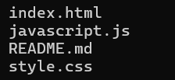
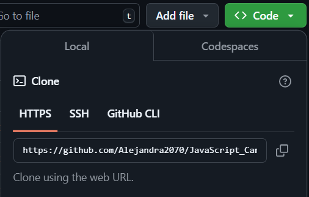

# Proyecto CampusBuild

## Descripción

Este aplicativo web tiene como objetivo optimizar sus procesos y mejorar la coordinación de sus equipos de trabajo.

## Tecnologías utilizadas

* HTML
* CSS
* JAVASCRIPT

## Estructura del Proyecto

## Características

|Nombre|Características|
|--|--|
|**index.html**|Este archivo contiene el código con la maquetación y lo necesario para el funcionamiento del diseño creado.|
|**style.css**|Este archivo contiene el código para dar el diseño a la maquetación realizada en el archivo index.|
|**README.md**|Este archivo contiene la documentación y explicación del código.|

## Diseño
Este diseño es totalmente responsive. Cuenta con un formulario para que los usuarios ingresen la información correspondiente y funcione correctamente el aplicativo. Además de esto, tiene algunas animaciones en la pantalla de bienvenida para una interfaz más visual e interactiva.

## Instrucciones
**1.** Clonar el repositorio cargado en GitHub.

**2.** Abrir en la nube el archivo index.html en un navegador web.

## Desarrollado por
Este proyecto fue desarrollado por Alejandra Machuca, estudiante de CampusLands como trabajo de refuerzo.